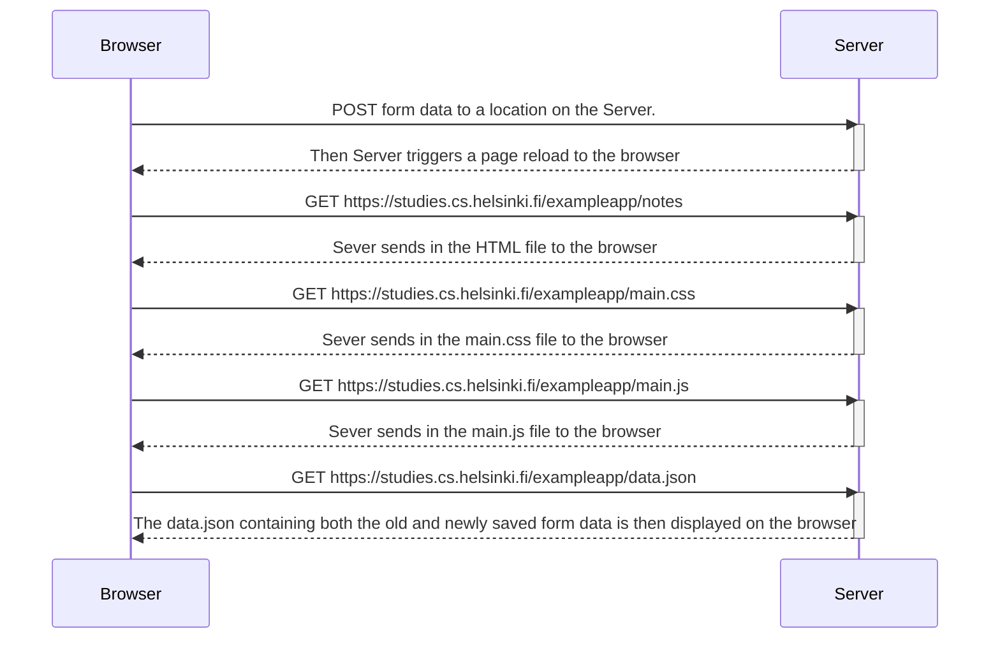

### The chain of events caused by opening the page https://studies.cs.helsinki.fi/exampleapp/notes is depicted as a sequence diagram below:

 

```mermaid
sequenceDiagram
participant A as Browser
participant S as Server

A ->> S: POST form data to a location on the Server.
activate S
S -->> A: Then Server triggers a page reload to the browser
deactivate S
A ->> S: GET https://studies.cs.helsinki.fi/exampleapp/notes
activate S
S -->> A: Sever sends in the HTML file to the browser
deactivate S
A ->> S: GET https://studies.cs.helsinki.fi/exampleapp/main.css
activate S
S -->> A: Sever sends in the main.css file to the browser
deactivate S
A ->> S: GET https://studies.cs.helsinki.fi/exampleapp/main.js
activate S
S -->> A: Sever sends in the main.js file to the browser
deactivate S
A ->> S: GET https://studies.cs.helsinki.fi/exampleapp/data.json
activate S
S -->> A: The data.json containing both the old and newly saved form data is then displayed on the browser
deactivate S
```
