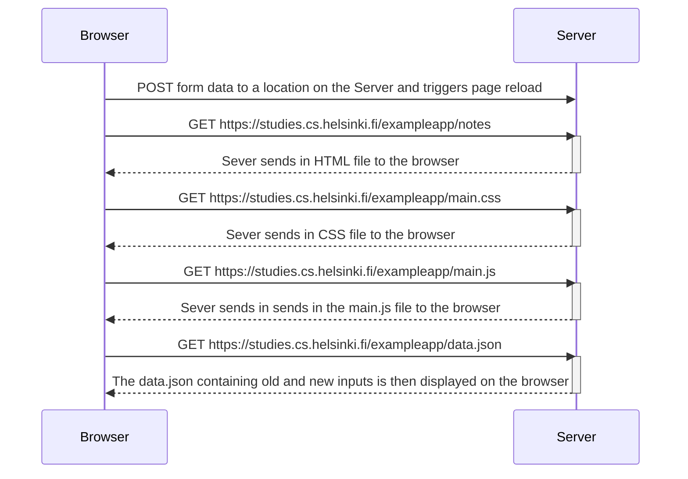

```mermaid
sequenceDiagram
participant A as Browser
participant S as Server

A ->> S: POST form data to a location on the Server and triggers page reload
A ->> S: GET https://studies.cs.helsinki.fi/exampleapp/notes
activate S
S -->> A: Sever sends in HTML file to the browser
deactivate S
A ->> S: GET https://studies.cs.helsinki.fi/exampleapp/main.css
activate S
S -->> A: Sever sends in CSS file to the browser
deactivate S
A ->> S: GET https://studies.cs.helsinki.fi/exampleapp/main.js
activate S
S -->> A: Sever sends in sends in the main.js file to the browser
deactivate S
A ->> S: GET https://studies.cs.helsinki.fi/exampleapp/data.json
activate S
S -->> A: The data.json containing old and new inputs is then displayed on the browser
deactivate S
```
