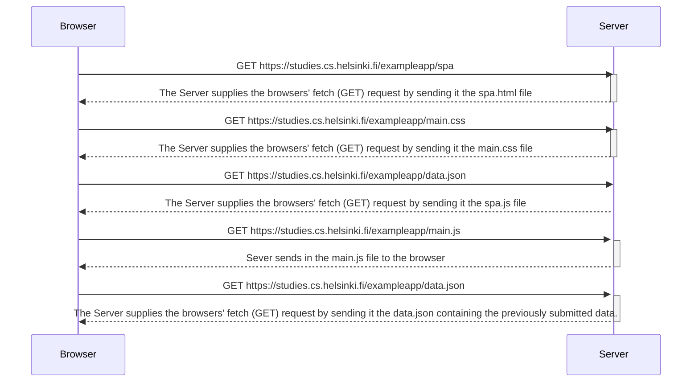

### The chain of events caused by opening the single-page app version of the notes app at https://studies.cs.helsinki.fi/exampleapp/spa is depicted as a sequence diagram below:

 

```mermaid
sequenceDiagram
participant A as Browser
participant S as Server

A ->> S: GET https://studies.cs.helsinki.fi/exampleapp/spa
activate S
S -->> A: The Server supplies the browsers' fetch (GET) request by sending it the spa.html file
deactivate S
A ->> S: GET https://studies.cs.helsinki.fi/exampleapp/main.css
activate S
S -->> A: The Server supplies the browsers' fetch (GET) request by sending it the main.css file
deactivate S
A ->> S: GET https://studies.cs.helsinki.fi/exampleapp/data.json
activate S
S -->> A: The Server supplies the browsers' fetch (GET) request by sending it the spa.js file
A ->> S: GET https://studies.cs.helsinki.fi/exampleapp/main.js
activate S
S -->> A: Sever sends in the main.js file to the browser
deactivate S
A ->> S: GET https://studies.cs.helsinki.fi/exampleapp/data.json
activate S
S -->> A: The Server supplies the browsers' fetch (GET) request by sending it the data.json containing the previously submitted data.
deactivate S
```
