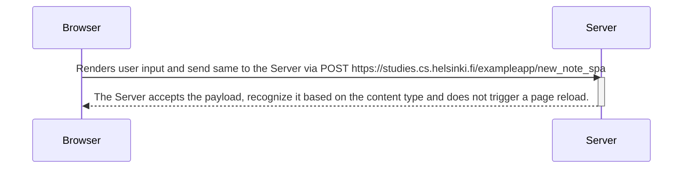

### The a sequence diagram below is depicting the situation where the user creates a new note using the single-page version of the app.

 

```mermaid
sequenceDiagram
participant A as Browser
participant S as Server

A ->> S: Renders user input and send same to the Server via  POST https://studies.cs.helsinki.fi/exampleapp/new_note_spa
activate S
S -->> A: The Server accepts the payload, recognize it based on the content type and does not trigger a page reload.
deactivate S
```
